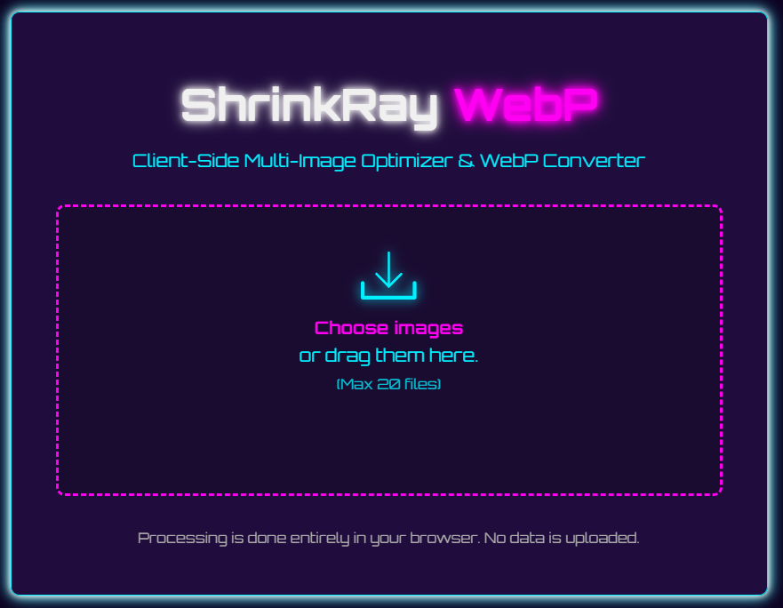

# ShrinkRay - Client-Side Image Optimizer & WebP Converter

Optimize images and convert them to the modern WebP format with a neon cyberpunk flair, entirely within your web browser. ShrinkRay processes images locally, ensuring your privacy and security.

# [Live Preview](https://n1ghtw1re.neocities.org/tools/shrinkray)
## Known issue: The tool does not work in Firefox browsers at the moment. It should work fine on Chrome, Brave and Edge. 

 

## Overview

ShrinkRay is a simple, fast, and private web application designed to optimize your PNG, JPG, or GIF images for web use by converting them to the efficient WebP format. Inspired by tools like TinyPNG but built with simplicity and privacy at its core, all processing happens directly in your browser using JavaScript – **your images are never uploaded to any server.**

This tool allows you to process multiple images at once and downloads the optimized WebP files conveniently packaged in a ZIP archive.

## Key Features

*   **🔒 Private & Secure:** All image processing is done client-side in your browser. Files are never uploaded.
*   **🚀 WebP Conversion:** Converts common image formats (PNG, JPG, GIF) to the highly efficient WebP format.
*   **⚙️ Lossy Optimization:** Reduces file size using WebP's quality settings (configurable).
*   **📦 Batch Processing:** Upload and process multiple images simultaneously (up to 20 files).
*   **💾 ZIP Output:** Downloads all converted images bundled in a single `.zip` file.
*   **📊 Size Comparison:** Shows total original size, total optimized size, and the percentage of space saved for the batch.
*   **🖱️ Drag & Drop:** Easily add images by dragging them onto the application window.
*   **✨ Neon Cyberpunk UI:** A distinct visual style inspired by cyberpunk aesthetics.
*   **🌐 No Server Dependency:** Runs entirely offline once the page is loaded.

## Technology Stack

ShrinkRay keeps things simple and accessible:

*   **HTML5:** For structuring the web page.
*   **CSS3 (Vanilla):** For styling and the neon cyberpunk aesthetic (using CSS variables).
*   **JavaScript (Vanilla ES6+):** For all the core logic, DOM manipulation, and image processing.
*   **Browser Canvas API:** Used internally to draw images and export them to the WebP format.
*   **[JSZip](https://stuk.github.io/jszip/) Library:** For creating ZIP archives directly in the browser (included via CDN).
*   **[Google Fonts (Orbitron)](https://fonts.google.com/specimen/Orbitron):** For the distinctive UI font.

## How to Use

1.  **Get the Code:**
    *   Clone this repository: `git clone https://github.com/your-username/shrinkray.git` (Replace with your repo URL)
    *   OR Download the ZIP file from the GitHub repository page.
    *   OR Access a hosted version if available.
2.  **Open:** Navigate to the project directory and open the `index.html` file in a modern web browser (Chrome, Firefox, Edge recommended for best WebP support).
3.  **Upload Images:**
    *   Click the **"Choose images"** button and select up to 20 PNG, JPG, or GIF files.
    *   OR Drag and drop your image files directly onto the designated area.
4.  **Processing:** Wait a few moments while ShrinkRay processes your images. The status message will update to show progress. For larger batches, creating the ZIP file might take a little extra time.
5.  **Download:** Once processing is complete, the results section will appear, showing summary statistics. Click the **"Download ZIP"** button to save the archive containing your optimized WebP images.
6.  **Optimize More:** Click the **"Optimize More"** button to reset the application and process new images.

## Configuration

*   **Optimization Quality:** The level of compression (and resulting quality) can be adjusted by changing the `WEBP_QUALITY` constant near the top of the `script.js` file.
    *   `1.0` = Highest quality, largest file size.
    *   `0.1` = Lowest quality, smallest file size.
    *   The default is `0.8`, offering a good balance.
    *   *(Future Enhancement Idea: Add a UI slider for quality selection).*

## Security and Privacy Considerations

*   **Client-Side:** This is the core privacy feature. Your image files are processed using JavaScript running *only* in your browser. They are not sent over the network to any server controlled by this application.
*   **Anonymity:** The application itself doesn't track *what* images you process.
*   **Standard Web Logs:** If accessing a hosted version, the web server hosting the files (`index.html`, `script.js`, etc.) will likely have standard access logs (your IP address requesting the files), similar to visiting any website. Likewise, the CDN hosting JSZip and Google Fonts will log requests for those resources. This logging is separate from the image processing itself.
*   **Code Trust:** As with any web application, you are running code served by the host. Ensure you trust the source from which you obtained or are accessing ShrinkRay.

## Contributing

Contributions, issues, and feature requests are welcome! Feel free to check the [issues page](https://github.com/your-username/shrinkray/issues) (Replace with your repo URL) or submit a pull request.

## License

This project is licensed under the MIT License - see the [LICENSE](LICENSE) file for details.

## Social Media and Contacts

Designed By: **N1ghtw1re Studios** ([N1ghtw1re Studios - Digital Collective](https://n1ghtw1re-studios.lovable.app/))

*   **Email:** n1ghtw1re@proton.me
*   **Bluesky:** [@n1ghtw1re.neocities.org](https://bsky.app/profile/n1ghtw1re.neocities.org)
*   **Mastodon:** [@n1ghtw1re@defcon.social](https://defcon.social/@n1ghtw1re)
*   **GitHub:** [@n1ghtw1re](https://github.com/n1ghtw1re)
*   **Patreon:** [N1GHTW1RE](https://www.patreon.com/c/N1GHTW1RE)
